# T03 - Seveis dde Tranferència de Fitxers
## SMX 2A | Edu Gordo Cebrià

---

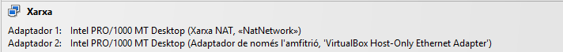

Per fer aquesta activitat, la nostra màquina virtual utilitzara un adaptador en "Xarxa NAT" i un altre en "Adaptdor de només l'anfitrió"

---

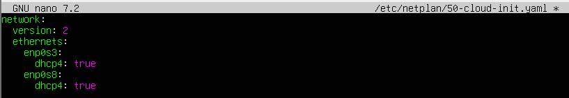

Ara si, entrem en la màquina del servidor d'Ubuntu i entrem en el fitxer del netplan per configurar els adaptadors

---

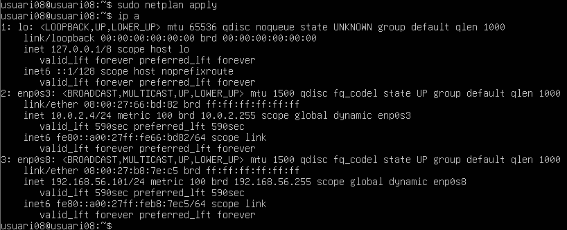

Apliquem els canvid del netplan i fem "ip a" per veure la nostra direcció IP

---

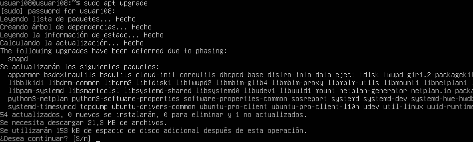
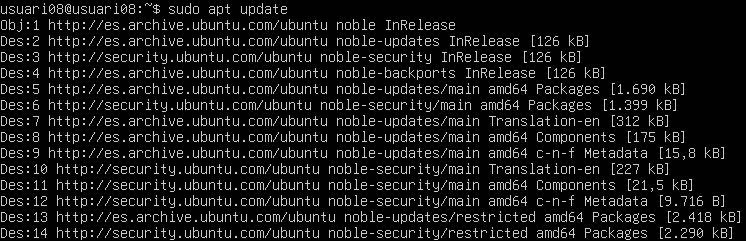

Actualitzem el sistema a l'última versió

---

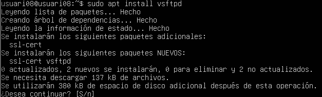

Instal·lem el sistema vsftpd

---

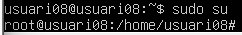

Iniciem sessió com a *root*

---

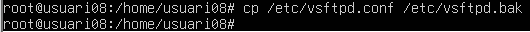

Copiem l'arxiu en format **.bak*

---

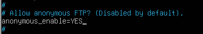

Ara, entrem en el fitxer i activem l'opció d'anonymous

---

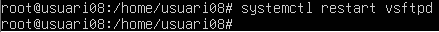

Reiniciem el sistema

---

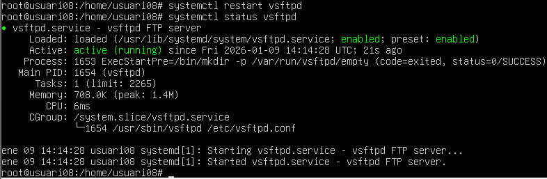

Confirmem l'estatus per veure que tot segueix funcionant correctament després dels canvis que hem fet

---

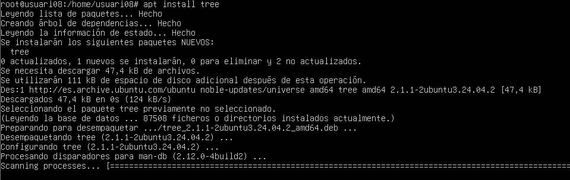

Instal·lem **tree* per veure el sistema de fitxers

---

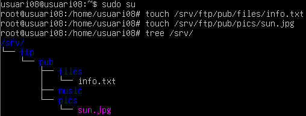

Creem els directoris i creem un fitxer d'info a la carpeta *files* i una imatge a la carpeta *pics*
Amb el *tree* comprovem com està organitzat el sistema de carpetes dins del directori */srv/*

---

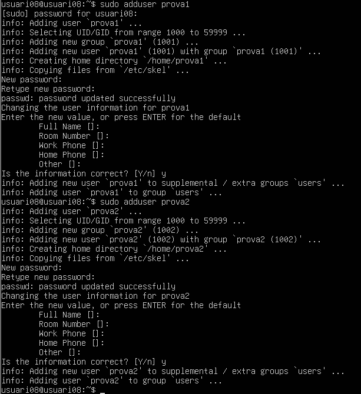

Ara creem dos usuaris, *prova1* i *prova2*

---

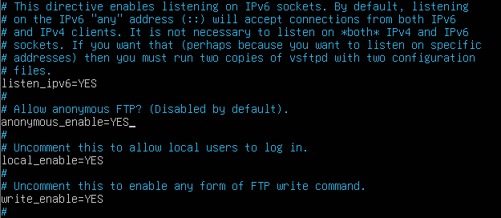

Tornem a entrar en el fitxer i han de quedar activades les 4 següents opcions
- listen_ipv6=YES
- anonymous_enable=YES
- local_enable=YES
- write_enable=YES

Ara, ja tindrem el servidor configurat, comprovem que sigui aixi reinician el sistema i veien l'estatus. Si tot segueix funcionant correctament, ja tenim el servidor

---

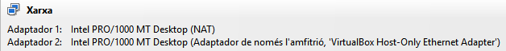

Pasem al client, utilitzem un client Windows que també tindrà dos adaptadors, *NAT* i *Adaptador de només l'anfitrió*

---

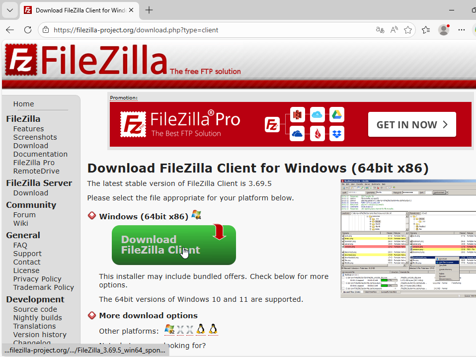

Instal·lem *FileZilla*

---

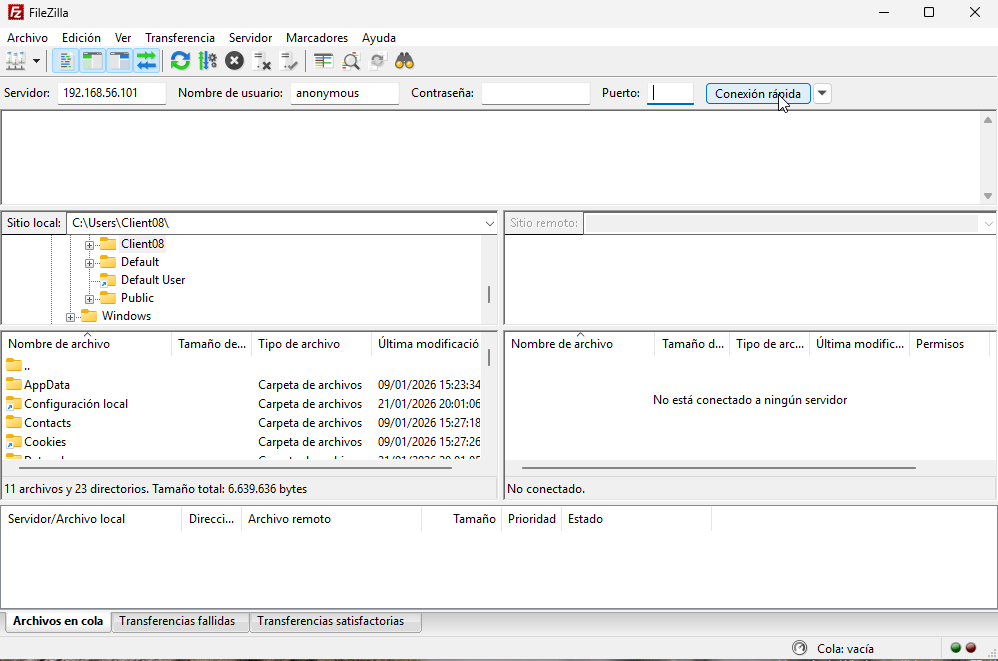

Al entrar en FileZilla trobarem aquesta pantalla oon haurem de posar la IP que teniem en el servidor

---

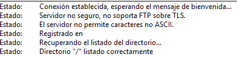

En el quadrat de l'estat ha d'apareixer un misatge com aquest indicant-nos que la connexió amb el servidor ha sigut correcte

---

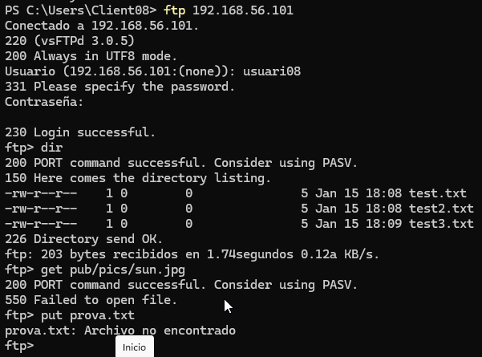

Entrem a la terminal de PowerShell y escribim la següent comanda:
ftp IP
Iniciarem sessió amb l'usuari del servidor que vulguem i la contrasenya assignada a aquell usuari

---

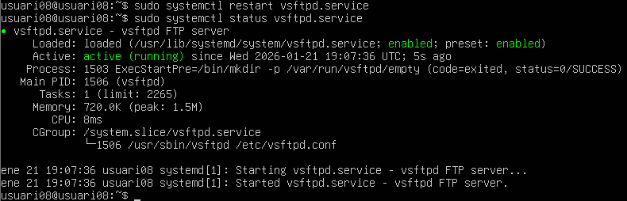

Comprovem que el sistema segueix funcionan comprvant l'estatus des del servidor.

---

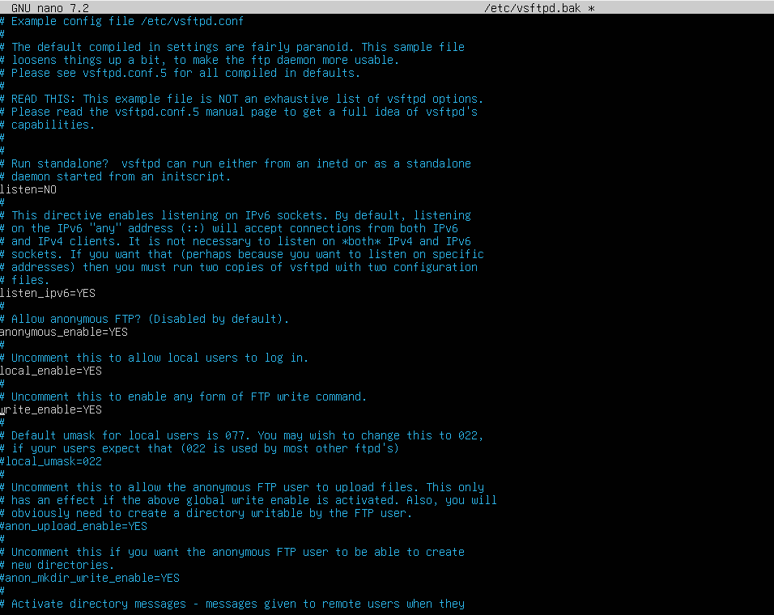

I tambe la configuració del fitxer

---

Iniciem sessió una altre cop en la terminal de PowerShell, aquesta vegada mab el usuari que hem creat de *prova1* i la contrasenya que li haguem posat

---

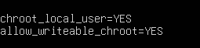

Ara, en el fitxxer del servidor escriurem en el final de tot les següents dues linies:

---

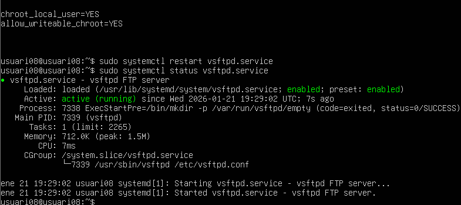

Després, guardarem la configuració, reiniciarem el servei i comprovarme l'estatus per veure que tot el servei segueix funcionant correctament

---

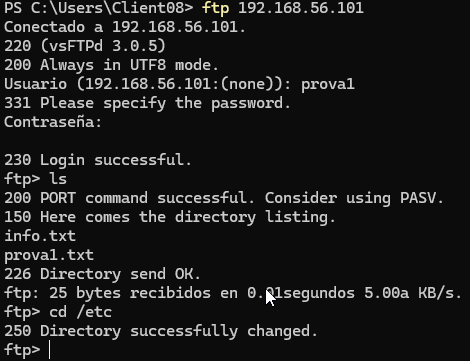

Tornem a iniciar sessió amb l'usuari que hem creat i podem veure que funciona i troba els fitxers que hem creat anteriorment

---

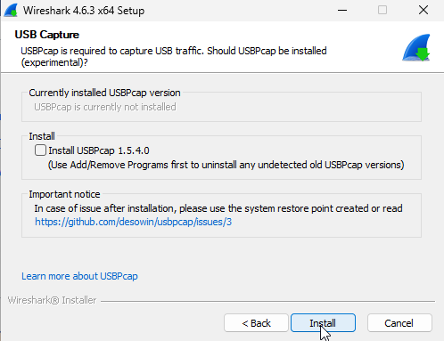

Ara, en el client instal·lem WireShark

---

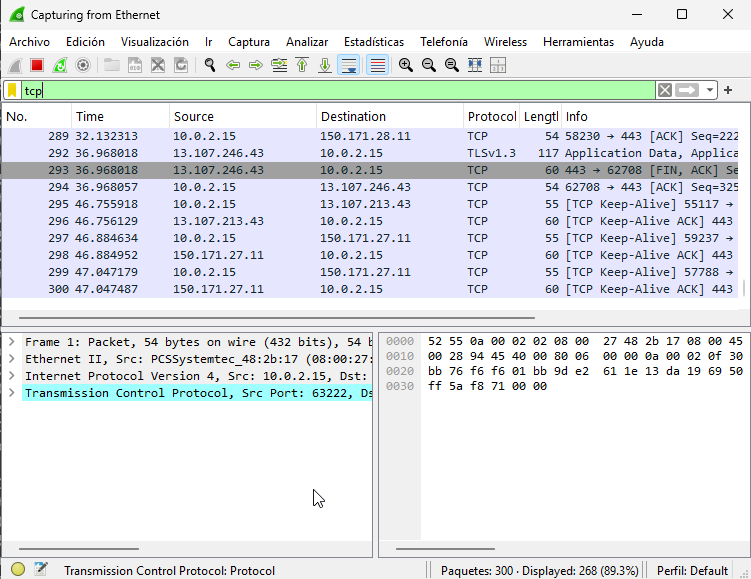

I comprovem que hi ha intercanvi de informació entre el sevidor i el client amb el protocol TCP o FTP
---

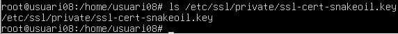

Dins del servidor, com a *root*, crearem el següent directori

---

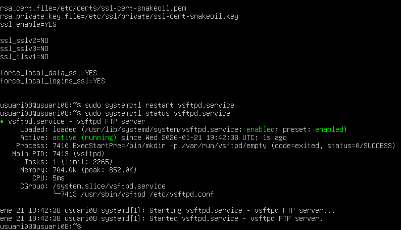

I en el fitxer del servei, escriurem 6 linies més:
- ssl_sslv2=NO
- ssl_sslv3=NO
- ssl_stlsv1=NO

- force_local_data_ssl=YES
- force_local_logins_ssl=YES

I reiniciarem el sistema i comprovarem l'estat

---

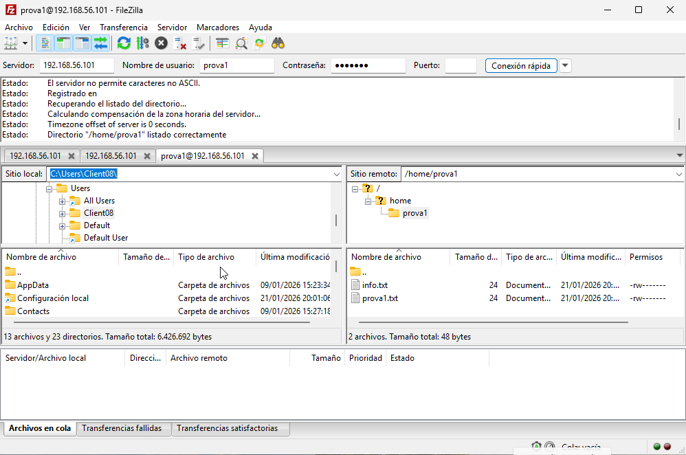

Ara, en el FileZilla, iniciem sessió amb la IP sel servidor i amb el nom i la contrasenya del usuari que hem cret, i podrem veure tots els seus directoris i fitxers

---

I amb aixó conclueix aquesta activitat pràctica.
